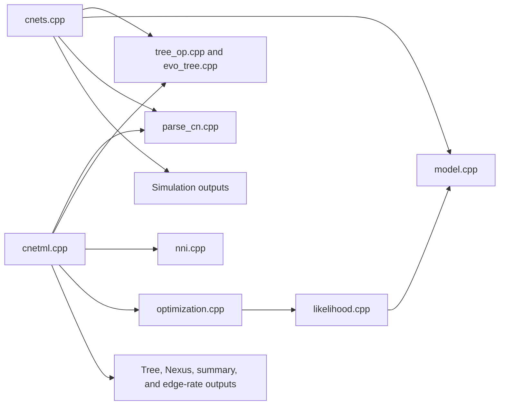
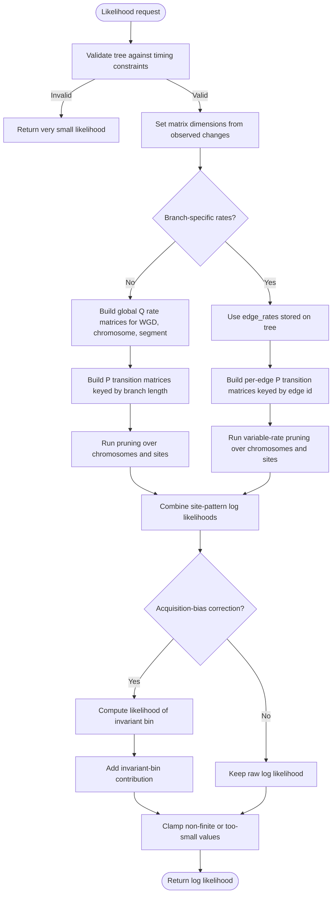
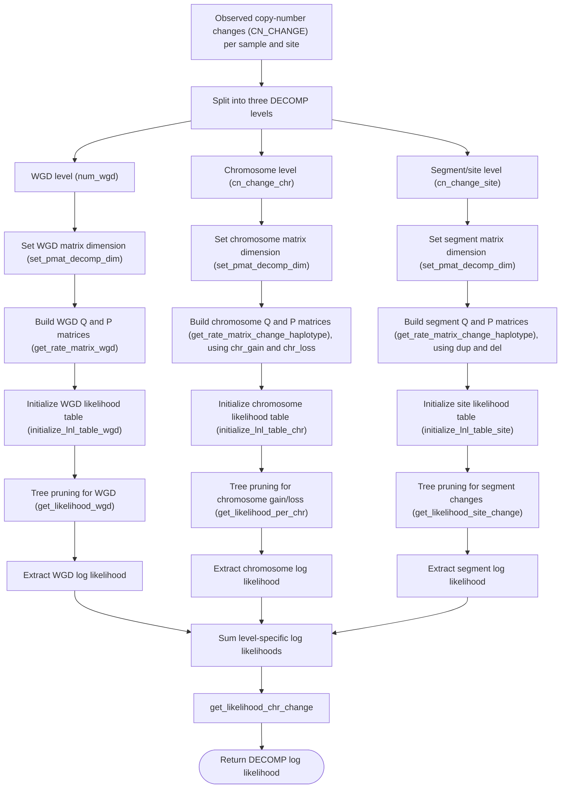
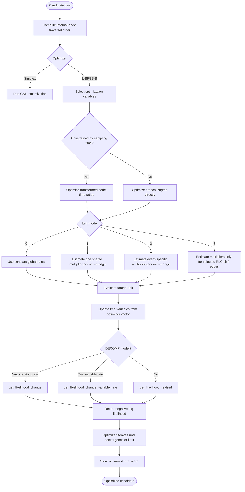
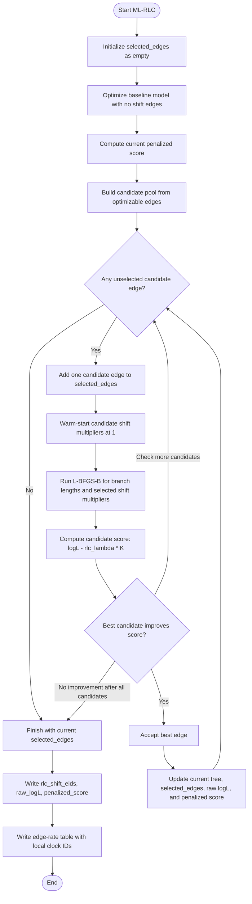

# Architecture

The current structure: independent command-line tools sharing C++ sources
under `code/`, before the planned `libcneta` core exists. See
[Repository layout](index.md#repository-layout) for the directory-level
view.

## How the main files fit together

## `cnetml` likelihood calculation

The current detailed likelihood path is the DECOMP path, where WGD,
chromosome-level changes, and segment-level changes are represented by
separate chains. Constant-rate and branch-specific-rate modes differ mainly
in how transition probability matrices are built.

For branch-specific-rate modes, the same three biological levels are used,
but transition matrices are built per edge from `tree.edge_rates` using
`build_transition_matrices_variable`. The traversal functions are then
`get_likelihood_wgd_variable`, `get_likelihood_per_chr_variable`, and
`get_likelihood_site_change_variable`, and the final aggregation happens in
`get_likelihood_chr_change_variable`.

## Three-level DECOMP likelihood

In the DECOMP model, observed copy-number changes are decomposed into three
biological levels. Segment/site changes are evaluated per site, chromosome
changes are evaluated once per chromosome, and WGD is evaluated once per
sample tree because it is shared across all sites.

## `cnetml` candidate tree optimization

For a fixed topology, `cnetml` optimizes branch lengths or node-time ratios,
and optionally rate parameters. With branch-specific-rate inference, the
optimizer updates `tree.edge_rates` before each likelihood evaluation.

## Random local clock shift-edge search

When `--bsr_mode 3` is used with `mode 3`, CNETML performs an outer greedy
search over shift edges. The score is `logL - rlc_lambda * K`, where `K` is
the number of selected shift edges.

:::{note}
These five diagrams come from the research team and cover `cnets` and
`cnetml`; `cnetmcmc` is intentionally not diagrammed yet. The top-level
`cnets` and `cnetml` workflows live in [Workflows](../workflows/index.md)
since they describe user-facing data flow rather than internals.
:::
