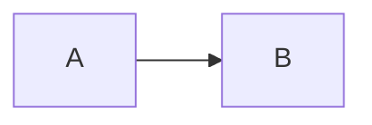

# Working on the documentation

## One-time setup

Python packages are listed once, in `docs/requirements.txt`. Everything
below installs that same set.

::::{tab-set}
:::{tab-item} conda (recommended)

```bash
conda env create -f docs/environment.yml
conda activate cneta-docs
```

`environment.yml` pulls in `requirements.txt` via pip, and additionally
provides `doxygen`, `graphviz`, and `make`.
:::

:::{tab-item} venv

```bash
python -m venv .venv
source .venv/bin/activate
pip install -r docs/requirements.txt
```

Install `doxygen` and `graphviz` separately — `brew install doxygen
graphviz` or `apt install doxygen graphviz`.
:::

:::{tab-item} uv

```bash
uv venv && source .venv/bin/activate
uv pip install -r docs/requirements.txt
```

Install `doxygen` and `graphviz` separately, as above.
:::
::::

## Adding a dependency

1. Add it to `docs/requirements.txt`.
2. Add it to `extensions` in `docs/source/conf.py` if it is a Sphinx
   extension.
3. Update your local environment:

   ```bash
   conda env update -f docs/environment.yml --prune
   ```

Do not add Python packages to `environment.yml` directly — that would
split the source of truth and quietly break the venv and uv workflows.

## Everyday use

```bash
make -C docs live      # live-reload preview at http://localhost:8080
make -C docs html      # one-off build into docs/build/html
make -C docs strict    # warnings-as-errors; this is what CI runs
make -C docs api       # regenerate the C++ API XML via Doxygen
make -C docs clean
```

If `make strict` passes locally, CI will pass.

## Writing pages

Pages are Markdown (MyST). Ordinary Markdown works; a few extras are
enabled:

- **Admonitions** — `:::{note}` … `:::`
- **Definition lists** — a term on one line, `: definition` on the next
- **Maths** — `$\lambda$` inline
- **Cross-references** — relative links such as
  `[Quick start](../quickstart/index.md)`

### Mermaid diagrams

Write a normal fenced block:

````markdown

````

`myst_fence_as_directive` in `conf.py` turns these into rendered diagrams,
so the same file displays correctly both here and on GitHub. Keep diagrams
in text form rather than exporting images.

### Adding a page

1. Create the `.md` file in the appropriate section directory.
2. Add it to the `toctree` in that section's `index.md`.

A page not listed in any `toctree` triggers a warning, which fails the
strict build.

## C++ API pages

Doxygen extracts comments from `code/` (excluding the vendored
`gzstream/`, `lbfgsb/`, and `matexp/` directories) into XML, which Breathe
renders in `api/cpp.md`. Configuration lives in `docs/Doxyfile`.

To document a function so it appears there:

```cpp
/// Compute the log-likelihood of a tree given copy-number data.
///
/// @param tree   the candidate tree
/// @param data   observed copy-number profiles
/// @return the log-likelihood
double get_likelihood(const evo_tree& tree, const CopyNumberData& data);
```

## Conventions

- Prefer Markdown over reStructuredText.
- Keep examples runnable and repository-local.
- Update documentation in the same pull request as the code it describes.
- Scientific content is owned by the research team; infrastructure,
  build/test guidance, and API generation by the RSE team.
