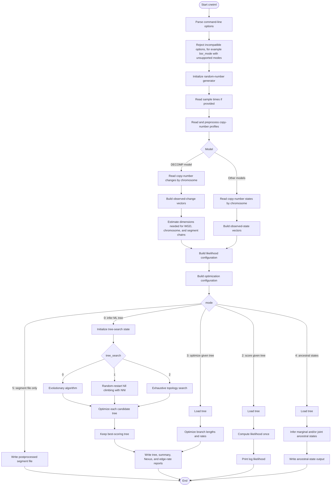

# Workflows and data flow

How the tools are chained together, and what data passes between them.

:::{note}
The diagrams below cover `cnets` and `cnetml`. `cnetmcmc` is less mature and
intentionally not diagrammed yet — see [MCMC workflow](#mcmc-workflow-cnetmcmc).
:::

## Simulation workflow (`cnets`)

`cnets` simulates copy-number evolution along a tree and writes simulated
copy-number profiles, timing information, mutation lists, and tree files.

## Maximum Likelihood Inference workflow (`cnetml`)

`cnetml` reads observed copy-number profiles and either searches for a
maximum-likelihood tree, scores a supplied tree, optimizes a supplied
topology, or reconstructs ancestral states.

For how the DECOMP likelihood itself is computed once this workflow reaches
"Build likelihood configuration", see
[Architecture](../developer-guide/architecture.md).

## MCMC workflow (`cnetmcmc`)

TODO + diagram. `cnetmcmc` is under active development; no diagram has been
supplied for it yet.

## Which tool produces what

TODO: table mapping outputs to the tools that consume them, and marking
each as required, optional, diagnostic, or intermediate.

## Future direction

TODO: in-memory exchange via `libcneta`; Nextflow as an orchestration layer.

A Nextflow pipeline from raw sequencing data, or sequence alignments, or copy number calls to phylogenetic analysis and downstream analysis (such as copy number signature attachment to the tree branches).
<!-- https://github.com/sivaranjanjohnson/building  -->
