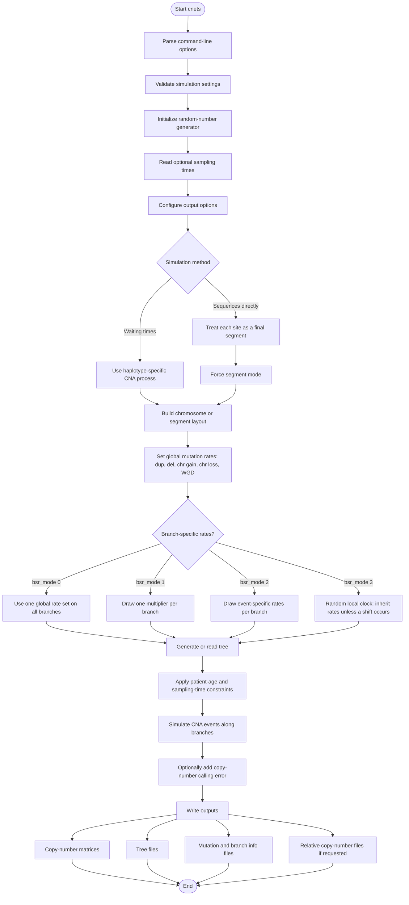
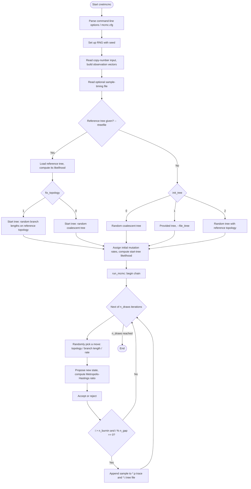

# Workflows and data flow

How the tools are chained together, and what data passes between them.

:::{note}
The `cnets` and `cnetml` diagrams below are the reviewed ones — those
tools are published and current priority. The [MCMC workflow](#mcmc-workflow-cnetmcmc)
diagram for `cnetmcmc` is a draft, since that tool isn't officially
released yet.
:::

## Simulation workflow (`cnets`)

`cnets` simulates copy-number evolution along a tree and writes simulated
copy-number profiles, timing information, mutation lists, and tree files.

## Maximum Likelihood Inference workflow (`cnetml`)

`cnetml` reads observed copy-number profiles and either searches for a
maximum-likelihood tree, scores a supplied tree, optimizes a supplied
topology, or reconstructs ancestral states.

For how the DECOMP likelihood itself is computed once this workflow reaches
"Build likelihood configuration", see
[Architecture](../developer-guide/architecture.md).

## MCMC workflow (`cnetmcmc`)

:::{warning}
**Draft.** `cnetmcmc` is not yet officially released — current focus is
`cnets` and `cnetml`. This diagram was traced from `code/cnetmcmc.cpp`
(`main`, `run_mcmc`, `run_with_reference_tree`) rather than from a
reviewed design doc, and has not been checked against the running
program's actual behaviour. Treat it as a starting point, not a
reference.
:::

:::{note}
Whether `--rtreefile` is given only decides where the *starting* tree
comes from. Whether the topology is actually held fixed during
sampling is a separate flag, `fix_topology`, used on both paths — this
differs from the summary in the top-level `README.md`, which describes
the reference tree itself as fixing the topology.
:::

## Which tool produces what

| file(s) | produced by | consumed by | status |
| --- | --- | --- | --- |
| `*-cn.txt.gz` / `*-haplotype-cn.txt.gz` | `cnets` (simulated); or preprocessing scripts for real data | `cnetml`, `cnetmcmc` | required |
| `*-rcn.txt.gz` / `*-haplotype-rcn.txt.gz` | `cnets` | external tools expecting relative copy number | optional |
| `*-inodes-cn.txt.gz` / `*-inodes-haplotype-cn.txt.gz` | `cnets` | downstream analysis of internal-node truth | diagnostic |
| `*-rel-times.txt` | `cnets` (simulated); or supplied directly for real data | `cnetml`, `cnetmcmc` | optional (needed for `estmu`/mutation-rate estimation) |
| `<prefix>-tree.txt`, `<prefix>-tree.nex`, `<prefix>-tree-nmut.nex` | `cnets` (ground truth) | `cnetml` (as an optional initial tree), `cnetmcmc` (`--file_itree`), accuracy comparisons | primary output |
| `<ofile>`, `<ofile>.nex`, `<ofile>.nmut.nex` | `cnetml` (reconstructed; `<ofile>` set by `-o`/`--ofile`, **not** `*-tree.*` — see [File formats](../file-formats/index.md#tree-formats)) | tree viewers (e.g. FigTree), downstream analysis, accuracy comparisons against `cnets`' output | primary output |
| `<ofile>.summary.txt`, `<ofile>.edge_rates.txt` | `cnetml` | run bookkeeping, per-branch rate analysis (`bsr_mode > 0`) | diagnostic |
| `*-info.txt`, `*-mut.txt`, `*-edge_rates.txt` | `cnets` | mutation-mapping / accuracy analysis; `*-edge_rates.txt` against `cnetml`'s reconstructed `<ofile>.edge_rates.txt` | diagnostic |
| `*-segs.txt` | `cnetml` (written when reading the input copy-number file, named by `--seg_file`) | intermediate to `cnetml`'s own likelihood computation | intermediate |
| `<ofile>.mrca.cn`, `<ofile>.joint.cn`, and (models 0-2) `<ofile>.mrca.state`/`<ofile>.joint.state`, or (model 3) `<ofile>.mrca.{seg,chr,wgd}.state`/`<ofile>.joint.state` | `cnetml` (mode 4, ancestral-state reconstruction) | downstream analysis of ancestral states | primary output (mode 4 only) |
| `mcmc.cfg` | hand-written / copied from the repository root | `cnetmcmc` (`--config_file`) | required by `cnetmcmc` |
| `*.p`, `*.t` | `cnetmcmc` (via `--trace_param_file`/`--trace_tree_file`; C++ defaults are `trace-mcmc-params.txt`/`trace-mcmc-trees.txt` — `run-cnetmcmc.sh` is what gives them `.p`/`.t` extensions) | Tracer / RWTY (`*.p`), TreeAnnotator (`*.t`) | primary output |

See [File formats](../file-formats/index.md) for column definitions of
each file.

## Future direction

TODO: in-memory exchange via `libcneta`; Nextflow as an orchestration layer.

A Nextflow pipeline from raw sequencing data, or sequence alignments, or copy number calls to phylogenetic analysis and downstream analysis (such as copy number signature attachment to the tree branches).
<!-- https://github.com/sivaranjanjohnson/building  -->
